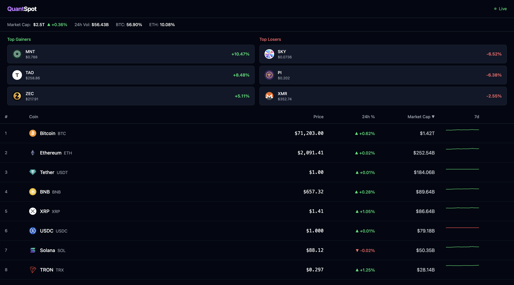

# QuantSpot

A real-time cryptocurrency market dashboard. Polls CoinGecko's free API, stores snapshots in MongoDB, serves data through a GraphQL API with WebSocket subscriptions, and renders an interactive React dashboard with live-updating prices, sparkline charts, and market statistics.



## Architecture

```
Frontend (React + TypeScript)
    |
    |  GraphQL queries + WebSocket subscriptions
    v
Backend (FastAPI + Strawberry GraphQL)
    |
    |  Async polling (60s) ──> CoinGecko API
    |  Motor (async driver)
    v
MongoDB (document store, 24h TTL indexes)
```

### Data flow

1. Backend polls CoinGecko `/coins/markets` and `/global` every 60 seconds
2. Raw responses are stored as timestamped documents in MongoDB
3. Frontend queries initial data via GraphQL over HTTP
4. Subsequent updates are pushed to the frontend via GraphQL subscriptions over WebSocket
5. Price changes trigger flash animations (green/red) on affected rows

## Tech Stack

| Layer | Technology | Why |
|---|---|---|
| **Backend** | FastAPI, Strawberry GraphQL | Async-native, type-safe GraphQL with subscription support |
| **Database** | MongoDB + Motor | Schema-flexible document store with async driver, TTL indexes for auto-cleanup |
| **Frontend** | React 19, TypeScript, Vite | Fast dev experience with strict typing |
| **State** | Apollo Client (HTTP + WS split link) | Unified cache for queries and subscriptions |
| **Charts** | Recharts | Composable, lightweight charting (sparklines + area charts) |
| **UI State** | Zustand | Minimal boilerplate for sort/selection state |
| **Styling** | Tailwind CSS 4 | Utility-first, dark theme |
| **Infra** | Docker Compose | Single-command orchestration (MongoDB + backend + frontend) |

## Features

- **Live prices** -- WebSocket subscriptions push updates every 60 seconds
- **Top 50 coins** -- Sorted by market cap, with 7-day sparkline charts
- **Global stats bar** -- Total market cap, 24h volume, BTC/ETH dominance
- **Top movers** -- Top 3 gainers and losers cards
- **Sortable table** -- Click column headers to sort by price, 24h change, or market cap
- **Coin detail panel** -- Click any row to slide out a panel with a 24h price area chart
- **Price flash animations** -- Green/red background flash when prices change
- **Connection indicator** -- Live/Disconnected status in the header
- **Dark theme** -- Designed for market data readability

## Project Structure

```
QuantSpot/
├── backend/
│   ├── app/
│   │   ├── config.py              # Pydantic Settings (env vars)
│   │   ├── db.py                  # Motor client, TTL indexes
│   │   ├── main.py                # FastAPI app, lifespan, CORS, GraphQL mount
│   │   ├── ingestion/
│   │   │   └── market_poller.py   # Background poller + broadcast
│   │   ├── graphql/
│   │   │   ├── types.py           # Strawberry types (Coin, GlobalStats, etc.)
│   │   │   ├── resolvers.py       # Query + Subscription resolvers
│   │   │   └── schema.py          # Schema assembly
│   │   └── services/
│   │       └── market_service.py  # Business logic layer
│   ├── requirements.txt
│   └── Dockerfile
├── frontend/
│   ├── src/
│   │   ├── graphql/               # Apollo Client, queries, subscriptions
│   │   ├── hooks/                 # useCoins, useGlobalStats, useTopMovers, usePriceHistory
│   │   ├── stores/                # Zustand (sort state, coin selection)
│   │   ├── components/
│   │   │   ├── layout/            # Header, DashboardLayout, ConnectionStatus
│   │   │   ├── market/            # GlobalStatsBar, TopMovers, CoinTable, CoinDetail
│   │   │   └── shared/            # SparklineChart, PriceChange, LoadingSkeleton
│   │   ├── utils/                 # Formatters, color helpers
│   │   └── types/                 # TypeScript interfaces
│   ├── Dockerfile
│   └── nginx.conf
└── docker-compose.yml
```

## Getting Started

### Prerequisites

- Python 3.11+
- Node.js 18+
- Docker (for MongoDB)

### Quick Start

**1. Start MongoDB**

```bash
docker run -d --name quantspot-mongo -p 27017:27017 mongo:7
```

**2. Start the backend**

```bash
cd backend
python -m venv .venv
source .venv/bin/activate
pip install -r requirements.txt
uvicorn app.main:app --reload
```

Backend runs at `http://localhost:8000`. GraphQL playground at `http://localhost:8000/graphql`.

**3. Start the frontend**

```bash
cd frontend
npm install
npm run dev
```

Dashboard runs at `http://localhost:5173`.

### Docker Compose (alternative)

Run everything with a single command:

```bash
docker compose up --build
```

- Frontend: `http://localhost:3000`
- Backend: `http://localhost:8000`
- MongoDB: `localhost:27017`

### Stopping

```bash
# Kill backend and frontend
lsof -ti:8000 | xargs kill
lsof -ti:5173 | xargs kill

# Stop MongoDB
docker stop quantspot-mongo
```

## API

### GraphQL Queries

```graphql
# Top coins by market cap
query {
  coins(limit: 50) {
    id name symbol currentPrice marketCap
    priceChangePercentage24h sparkline7d
  }
}

# Global market stats
query {
  globalStats {
    totalMarketCapUsd totalVolume24hUsd
    btcDominance ethDominance
  }
}

# Top gainers/losers
query {
  topMovers(direction: "up", limit: 5) {
    id name symbol currentPrice priceChangePercentage24h
  }
}

# 24h price history (fetched on demand from CoinGecko)
query {
  priceHistory(coinId: "bitcoin") {
    timestamp price
  }
}
```

### GraphQL Subscriptions

```graphql
subscription { pricesUpdated { id currentPrice priceChangePercentage24h } }
subscription { globalStatsUpdated { totalMarketCapUsd btcDominance } }
```

## Environment Variables

| Variable | Default | Description |
|---|---|---|
| `MONGODB_URL` | `mongodb://localhost:27017` | MongoDB connection string |
| `DB_NAME` | `quantspot` | Database name |
| `COINGECKO_BASE_URL` | `https://api.coingecko.com/api/v3` | CoinGecko API base URL |
| `POLL_INTERVAL_SECONDS` | `60` | Polling interval in seconds |

## Notes

- CoinGecko's free API allows ~30 requests/minute. The default 60-second poll interval stays well within limits.
- MongoDB documents have a 24-hour TTL index, so old snapshots are automatically cleaned up.
- The WebSocket subscription uses the `graphql-transport-ws` protocol (via the `graphql-ws` npm package).
